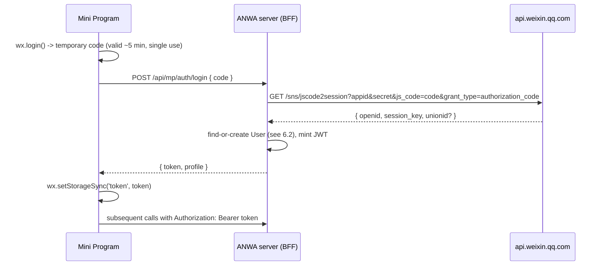
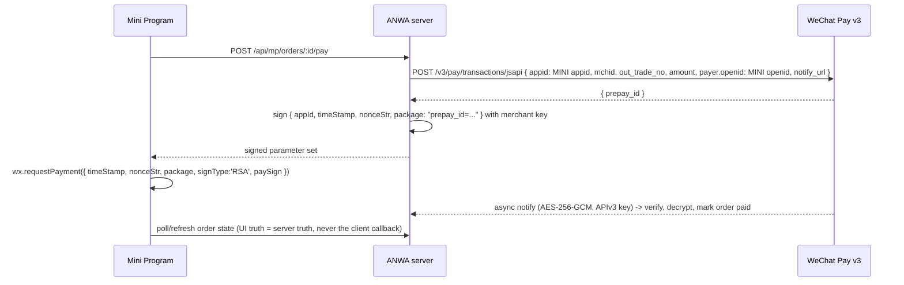

# Mini Program Technical Runbook

The step-by-step technical companion to the [Mini Program Playbook](mini-program-process.html).
The Playbook explains *why*; this runbook is the *how* — the exact procedures, API calls,
console paths, and code touchpoints for taking the ANWA WeChat Mini Program from
"registered appid nobody has opened" to "released and iterating".

Source of project facts: *HANDOFF — ANWA WeChat Mini Program (investigation)*, 2026-08-09.
Platform mechanics reflect the WeChat Mini Program platform generally — always confirm
current limits and console layouts against the live console, since Tencent moves things.

**Standing rules (apply to every phase):**

1. **Facts before code** — anything a console screen can answer, answer there first and record it.
2. **Client latency is the critical path** — AppSecret, merchant settings, and qualification
   documents all route through Terry / the account administrator. Batch requests; never let
   engineering idle waiting on one.
3. **Production quarantine is active** — all work on its own branch; testing only in the
   Mini Program's 开发版/体验版 lanes.
4. **Business logic has one home** — the existing service layer under the tRPC routers.
   The Mini Program gets a thin API on top of it, never a second implementation.

---

## Contents

- [Phase 0 — Establish console facts](#phase-0--establish-console-facts)
- [Phase 1 — Gate 1: category qualification](#phase-1--gate-1-category-qualification-类目资质)
- [Phase 2 — Gate 2: entity & Open Platform binding](#phase-2--gate-2-entity--open-platform-binding)
- [Phase 3 — Write the recommendation](#phase-3--write-the-recommendation)
- [Phase 4 — Development environment setup](#phase-4--development-environment-setup)
- [Phase 5 — The API layer (BFF)](#phase-5--the-api-layer-bff)
- [Phase 6 — Authentication & identity linking](#phase-6--authentication--identity-linking)
- [Phase 7 — Payments (小程序支付)](#phase-7--payments-小程序支付)
- [Phase 8 — Video playback](#phase-8--video-playback)
- [Phase 9 — Compliance before release](#phase-9--compliance-before-release)
- [Phase 10 — The release pipeline](#phase-10--the-release-pipeline)
- [Phase 11 — Post-release operations](#phase-11--post-release-operations)
- [Appendix A — Key identifiers](#appendix-a--key-identifiers)
- [Appendix B — Console map](#appendix-b--console-map)
- [Appendix C — Error diagnostics](#appendix-c--error-diagnostics)

---

## Phase 0 — Establish console facts

**Goal:** a recorded snapshot of the Mini Program's actual state. The appid
`wxa771184f0d69e0e4` is registered but its console (mp.weixin.qq.com) has never been opened.

**Who:** requires the client (Terry / account administrator) to log in, or to grant you a
role. Schedule one session and collect *everything* below in it — this is the batching rule.

### Steps

1. **Log in to mp.weixin.qq.com** with the Mini Program account (not the Official Account —
   same console URL, different account; this is exactly the confusion that cost a day).
2. Record from **设置 → 基本设置 (Settings → Basic settings)**:
   - 主体信息 (registered entity) — company name and type. *Feeds Gate 2.*
   - 服务类目 (service category) — what, if anything, is declared. *Feeds Gate 1.*
   - Account status: any pending verification (微信认证) or annual review flags.
3. Record from **开发 → 开发管理 → 开发设置 (Development settings)**:
   - AppID (confirm it matches `wxa771184f0d69e0e4`).
   - Whether an **AppSecret** has ever been generated. Generating/resetting it invalidates
     the old one — coordinate before touching it, and store it in the server's secret store
     (alongside the existing WeChat OAuth secrets), never in the repo.
   - 服务器域名 (server domain whitelist) — almost certainly empty; see Phase 4 for what goes here.
4. Record from **成员管理 (Member management)**: who is administrator, who are
   开发者 (developers) / 体验成员 (beta testers). Request developer roles for the team now —
   it's needed for Phase 4 and costs another round trip if forgotten.
5. Check **微信支付 (WeChat Pay)** menu: is any merchant account (商户号) already associated?
6. Log in to **open.weixin.qq.com** (Open Platform) if the client has an account there, and
   record which of the three appids are bound. *Feeds Gate 2.*

### Checkpoint

You have a written fact sheet: entity, category, AppSecret state, domain whitelist state,
member roles, payment association, Open Platform bindings. **Do not proceed on assumptions
for any of these.**

> Diagnostic reminder from the handoff: you cannot classify an appid from outside.
> Both an Official Account and a Mini Program return `Scope 参数错误或没有 Scope 权限`
> on the QR-connect endpoint; only a fake appid returns `AppID 参数错误`. The console
> (or a successful `code2session` with the secret) is the only ground truth.

---

## Phase 1 — Gate 1: category qualification (类目资质)

**Goal:** a yes/no/conditional verdict on whether ANWA may sell courses in a Mini Program.
**This can invalidate the whole plan — nothing downstream starts until it's answered.**

### Steps

1. In **设置 → 基本设置 → 服务类目**, attempt to add the category that matches ANWA's
   content (education/training categories live under 教育 — e.g. online education /
   training services). The console lists the **required qualification documents inline**
   when you select a category — this listing is authoritative, current, and beats any
   third-party summary.
2. Record exactly which documents the chosen category demands. For online
   education/training this is typically a **办学许可证** (private school operating permit)
   or an equivalent credential (e.g. 互联网信息服务 / ICP-related permits plus
   education-authority filings), issued to a **mainland Chinese entity** — the same entity
   that owns the Mini Program.
3. Ask the client, in writing, whether the owning entity holds those documents. Get copies
   or certificate numbers, not verbal assurance.
4. If the documents exist → submit them with the category application in the console and
   record the review outcome (category review is its own mini-review, days not minutes).
5. If they don't exist, establish the fallback matrix with the client:
   - **Informational-only Mini Program** (browse content, no enrolment, no payment) under a
     non-restricted category — does that still meet the business goal?
   - **Acquire the qualification** — what does that cost in time, and does the plan wait?
   - **No Mini Program** — the honest option if neither works.

### Checkpoint

A written verdict: category X, documents held/not held, review passed/failed/not-attempted,
and the agreed fallback. The Official Account's 微信认证 is **irrelevant** to this gate —
different platform, different review. Selling courses under a wrong category is grounds for
takedown after launch, which is why this is checked before code, not after.

---

## Phase 2 — Gate 2: entity & Open Platform binding

**Goal:** confirm all three WeChat properties sit under one entity and one Open Platform
(开放平台) account, so users share a **UnionID** and payment binding stays simple.

### Why it matters (mechanically)

- WeChat issues a **different `openid` per property** for the same human. With all
  properties bound under one Open Platform account, `code2session` (and the OA's OAuth
  userinfo) additionally return a **`unionid`** that is constant for that human across all
  of them. That `unionid` is the join key between a website student and a Mini Program user.
- The schema is ready for it: `User.wechatUnionId` already exists; `User.wechatOpenId`
  (unique) currently holds the **Official Account** openid.
- Merchant binding (Phase 7) within one entity is a routine confirmation; across two
  entities it becomes a slow cross-company authorization.

### Steps

1. From the Phase 0 fact sheet, compare the 主体 (entity) on the Mini Program console with
   the entity on the Official Account console. Same company name → good.
2. On **open.weixin.qq.com → 管理中心**, check which appids are bound:
   - Official Account `wxd872cc6f39051da2` — bind under 公众账号.
   - Website App `wxb59ede2ba485a76b` — this one was *created* on the Open Platform, so it
     anchors the account.
   - Mini Program `wxa771184f0d69e0e4` — bind under 小程序.
3. If the Mini Program is unbound: binding is initiated on the Open Platform and confirmed
   by the Mini Program administrator. **The Open Platform account itself must be verified
   (开发者资质认证) for UnionID to be issued.** Check that too.
4. **Verify empirically** once you have the AppSecret and a test login (Phase 6): a
   `code2session` response containing `unionid` proves the binding end-to-end. Then
   cross-check that this `unionid` equals the `wechatUnionId` stored for the same human's
   website account.

### Checkpoint

Either: "same entity, all three bound, `unionid` observed in a real `code2session`
response" — or a written prerequisite task for the client with owners and dates. If the
entities differ, escalate immediately: identity linking falls back to email verification
(Phase 6 fallback) and the timeline changes.

---

## Phase 3 — Write the recommendation

**Goal:** the actual deliverable of the current workstream — a document in `docs/`
(suggested: `docs/MINI-PROGRAM-PLAN.md` on the workstream branch). **No implementation
before this is reviewed.**

Required sections (from the handoff), with what "done" looks like:

| # | Section | Done means |
|---|---|---|
| 1 | Feasibility verdict | Gate 1 outcome stated with evidence (console screenshots / certificate numbers) |
| 2 | v1 scope | In-list and out-list with a reason per exclusion; sized against the 2 MB main / 20 MB total package caps |
| 3 | API layer decision | Chosen option + the two rejected options with reasons (see Phase 5) |
| 4 | Auth & identity design | Sequence diagrams for new-user and returning-website-student flows (see Phase 6) |
| 5 | Framework | Native vs Taro/uni-app, weighted by the team's real skills; sharing claims limited to types + pure logic |
| 6 | Effort estimate | Phased, with client-dependency clocks (qualification, merchant binding, Open Platform binding) shown as parallel tracks |
| 7 | Risk list | Each risk tagged **rebuild-class** (invalidates architecture) or **fix-class** (absorbable) |

Rebuild-class risks to carry into section 7 at minimum: category rejection after build;
entities differ (no UnionID); VOD unplayable in-runtime (Phase 8); package-cap overflow
from framework overhead.

---

## Phase 4 — Development environment setup

**Goal:** a working local dev loop. Starts only after the plan is approved.

### 4.1 Tooling

1. Install **微信开发者工具 (WeChat DevTools)** — the mandatory IDE/simulator. Each
   developer logs in with their personal WeChat, which must have a **开发者 role** in the
   Mini Program's 成员管理 (requested in Phase 0).
2. Create the project in DevTools with appid `wxa771184f0d69e0e4`. Framework choice from
   the plan decides the scaffold:
   - **Native**: `app.json` (pages, window, subpackages), WXML/WXSS/JS per page.
   - **Taro**: React-style source compiled to the native format; the compiled output is
     what DevTools runs and what gets uploaded.
3. Repo layout: a new workspace package (e.g. `apps/miniprogram/`) in the existing monorepo,
   so it can import shared **types and pure logic only** from `packages/*`. It cannot import
   React components, Node APIs, or anything touching `window`/`document`.

### 4.2 Server domain whitelist (服务器域名)

`wx.request` refuses any host not whitelisted in **开发 → 开发设置 → 服务器域名**. Rules:

- HTTPS only, domain must have a valid cert and (for CN) an ICP filing — `anwa-cn.com`
  qualifies (粤ICP备2026034782号-1).
- Separate lists for `request` (API), `uploadFile`, `downloadFile` (media — VOD play
  domains go here), and WebSocket.
- **Changes are limited to ~5 per month** — plan the list once, don't iterate through it.
- Whitelist the **production API host** plus one stable staging host. For local dev, tick
  DevTools' "不校验合法域名" (skip domain check) — it only affects the simulator/preview,
  never released builds.

### 4.3 Environment & secrets

- Server-side env vars for the new appid pair (e.g. `WECHAT_MINIPROGRAM_APP_ID`,
  `WECHAT_MINIPROGRAM_APP_SECRET`) alongside the existing OA/website-app credentials.
  The secret lives only on the server (the Lighthouse box's env / pm2 config) — the Mini
  Program client never sees it.
- `code2session` and other `api.weixin.qq.com` calls are **server-to-WeChat** calls; the
  existing Guangzhou box reaches them natively.

### Checkpoint

A "hello world" page runs in the simulator, on a real phone via **preview QR**, and can
`wx.request` the staging API without a domain error.

---

## Phase 5 — The API layer (BFF)

**Goal:** the Mini Program talks to the existing backend without duplicating business logic.

### The decision (recommended by the handoff's analysis)

Build a **REST/BFF layer inside the existing Next.js app**, e.g. route handlers under
`apps/web/src/app/api/mp/*`, that call the **same service layer the tRPC routers use**
(`apps/web/src/server/routers/` today delegates to services — reuse those, not the routers).

Rejected options and why (record these in the plan):

- **tRPC over a custom link for `wx.request`** — possible, but fights the runtime (no
  fetch/cookies, batching semantics, error shapes) and welds the Mini Program to internal
  API churn.
- **Separate backend service** — two implementations of pricing/enrolment eligibility will
  drift. The migration's cached-Prisma-client incident (a stale schema silently emptying a
  homepage section) is the canonical warning.

### Design rules

1. **Thin handlers**: parse/validate input (zod), call service, shape output. No business
   rules in the handler.
2. **Auth via header**, not cookie: `Authorization: Bearer <token>` (Phase 6). A tiny
   middleware resolves it to the same session object the web app uses.
3. **Versioned, deliberate surface** — only what v1 needs:

   ```text
   POST /api/mp/auth/login          wx.login code -> app token
   POST /api/mp/auth/link           email-verification fallback linking
   GET  /api/mp/courses             catalogue (paginated, lean payloads)
   GET  /api/mp/courses/:id         detail
   POST /api/mp/enrolments          enrol (free) / create order (paid)
   POST /api/mp/orders/:id/pay      -> wx.requestPayment parameter set
   GET  /api/mp/lessons/:id/play    -> signed VOD playback data
   POST /api/mp/progress            lesson progress upsert
   GET  /api/mp/me                  profile + enrolments + progress
   ```

4. **Lean payloads**: the client is size- and network-constrained; return exactly the
   fields each screen renders.
5. **Stable error contract**: `{ code, message }` with app-level codes the client can
   branch on (e.g. `AUTH_EXPIRED` → silent re-login, Phase 6).

### Checkpoint

`GET /api/mp/courses` returns real catalogue data in the simulator, and the handler
demonstrably calls the same service function the website's catalogue uses.

---

## Phase 6 — Authentication & identity linking

**Goal:** a Mini Program session system, plus recognising existing website students.

### 6.1 The login flow



Implementation notes:

- **`session_key` never leaves the server.** Store it server-side keyed by user (it's
  needed only if you later decrypt WeChat-provided encrypted data, e.g. phone numbers).
  Never send it to the client, never log it.
- **Token**: extend the existing native session module
  (`packages/auth/src/native-session.ts`, jose HS256) with a sibling issuer for
  `client: "miniprogram"` tokens — same signing key and claims shape, different transport
  (header, not cookie). This keeps one auth implementation.
- **Client session lifecycle**: on cold start, if a stored token exists call
  `wx.checkSession()`; on failure or an `AUTH_EXPIRED` API response, silently re-run
  `wx.login()` → refresh the token. Users should never see a login screen for expiry.
- Only ask WeChat for profile/nickname via the user-gesture APIs when actually needed —
  every data point collected must be covered by the privacy declaration (Phase 9).

### 6.2 Identity linking (find-or-create logic, in order)

1. **`unionid` present** (Gate 2 open) → look up `User.wechatUnionId`:
   - Match → same human as a website account. Attach the Mini Program openid and log in.
   - No match → new user; create with `wechatUnionId` + Mini Program openid.
2. **No `unionid`** (Gate 2 closed / unbound) → fallback: create a provisional user, then
   offer "already a student? link your account" → reuse the **proven** email-verification
   flow behind `/api/auth/wechat/link` (send code to email, verify, merge accounts).
3. **Schema decision (required either way):** the Mini Program `openid` is a *different
   value* from the OA openid in `User.wechatOpenId`. Add a distinct column, e.g.
   `wechatMiniOpenId String? @unique` — do **not** overload `wechatOpenId`. Migration via
   the normal Prisma flow, and regenerate the client everywhere (the stale-client incident
   again).

### Checkpoint

- New phone → account created, token persists across app restarts.
- A phone whose WeChat is linked to an existing **website** account → lands in that
  account's enrolments without any email step (proves UnionID end-to-end, closes Gate 2
  empirically).

---

## Phase 7 — Payments (小程序支付)

**Goal:** charge for a course inside the Mini Program via WeChat Pay.

### 7.1 The administrative clock (start first — client-dependent)

The merchant account (商户号) must be **associated with the Mini Program appid**:

1. Merchant **super admin** on pay.weixin.qq.com: 产品中心 → APPID账号管理 → 关联APPID →
   enter `wxa771184f0d69e0e4`.
2. Mini Program **administrator** on mp.weixin.qq.com confirms the association
   (微信支付 menu).
3. Ensure the JSAPI/小程序支付 product is activated on the merchant profile.

Two different humans, two different consoles, both client-side — this is the single
slowest dependency; run it in parallel with everything else.

### 7.2 The technical flow

The adapter `packages/payments/src/wechat-pay-adapter.ts` already signs WeChat Pay **v3**
requests, decrypts callbacks, and has offline tests. Changes needed are configuration-level:



Rules:

- The `appid` in the prepay request and the `openid` in `payer` must both be the **Mini
  Program's** — mixing in OA values yields signature/param errors. Parameterise the adapter
  per client app rather than forking it.
- Order fulfilment happens **only** on the verified server notification, never on
  `wx.requestPayment`'s success callback (the user can kill the app mid-callback).
- Reuse the adapter's existing notify handler; the notify URL must be on the ICP-filed
  domain and reachable over HTTPS.
- Test path: WeChat Pay has no full sandbox for v3 worth relying on — standard practice is
  a **1-jiao (¥0.10) real transaction** on the 体验版, then refund via the merchant console.

### Checkpoint

A ¥0.10 course purchase on a real phone in 体验版: payment sheet opens, server receives
and decrypts the notification, order flips to paid, enrolment appears.

---

## Phase 8 — Video playback

**Goal:** confirm course video (Tencent VOD, CN) plays inside the Mini Program — early,
because it's rebuild-class if it fails.

1. **Spike, before v1 work**: one page with the `<video>` component playing a real,
   protected VOD asset.
2. Whitelist VOD play/CDN domains under the **downloadFile/request 合法域名** lists
   (Phase 4.2) — the usual first failure.
3. Verify the protection scheme carries over:
   - **Key anti-leech / play-signature URLs** (referrer + expiring signature): server
     endpoint `GET /api/mp/lessons/:id/play` mints the signed URL per request — works with
     the plain `<video>` component.
   - **HLS encryption / DRM**: confirm the current VOD transcoding templates produce
     streams the Mini Program runtime can decode; if the setup relies on the web
     superplayer's decryption, test its **Mini Program build (TCPlayer 小程序版)** explicitly.
4. Test on real low/mid-range Android hardware, not just the simulator — codec support and
   performance differ.
5. Record results in the plan; failures here change architecture (e.g. re-transcode
   templates), which is why this is Phase 8 by number but **spiked during Phase 3**.

---

## Phase 9 — Compliance before release

**Goal:** clear the two non-negotiables that block review.

### 9.1 Privacy declaration (用户隐私保护指引)

- Console: **设置 → 服务内容声明 → 用户隐私保护指引**. Declare every category of personal
  information the app touches (identifiers/openid, contact email if linking, payment
  status, viewing progress, etc.) and its purpose.
- Since 2023, privacy-related APIs **fail at runtime** unless declared — the app must also
  handle the user-facing privacy authorization popup on first use.
- The declaration itself goes through a short review. File it before the first 体验版 that
  real client testers use, not the night before submission.

### 9.2 PIPL

The same obligations already met for the website apply to the Mini Program's data:
consent basis for each field, data kept on the CN infrastructure (TencentDB/COS — already
true), and a user-facing privacy policy consistent with the console declaration.

### 9.3 Content review reality

Education content is a sensitive vertical: course titles, covers, and descriptions are all
review surface. Keep v1's visible content aligned with the approved 类目 — content outside
the declared category is a standard rejection reason.

---

## Phase 10 — The release pipeline

**Goal:** a repeatable path from commit to public release. The rhythm:

```text
local dev (simulator + preview QR)
   -> 开发版  (upload from DevTools; team's dev phones)
   -> 体验版  (admin promotes one upload; invited testers incl. client)
   -> 提交审核 (submit for review; days, not minutes)
   -> 发布    (full or staged rollout)
```

### Steps per release

1. **Version & upload**: from DevTools (or `miniprogram-ci` for automation — it needs an
   upload key generated in the console, another admin task to batch), upload the build with
   a semver-ish version and a changelog line. Every upload is a 开发版.
2. **Promote to 体验版**: an admin marks one upload as the trial version. Testers must be
   added as 体验成员 in 成员管理. This is where the client signs off features and where the
   ¥0.10 payment test runs.
3. **Pre-submission checklist** (gate your CI on what's automatable):
   - Package budget: main ≤ 2 MB, total ≤ 20 MB across subpackages — check the DevTools
     size report; images belong on COS/CDN, not in the package.
   - All runtime hosts whitelisted (no "url not in domain list" in console logs).
   - Privacy declaration matches the APIs actually called.
   - Screens outside the declared 类目 removed or hidden.
4. **提交审核 (submit for review)**: fill the page-feature mapping honestly; provide a test
   account (a pre-enrolled student login) so the reviewer can see the paid area — reviews
   fail when reviewers hit a paywall they can't cross.
5. **Handle the verdict**: rejections come with reasons; fix, re-upload, resubmit. Budget
   at least one rejection round into every schedule.
6. **发布 (release)**: full release, or staged rollout (分阶段发布) by percentage for risky
   changes.

### Planning rule

Batch features into review-sized releases. There is no same-day hotfix: an emergency fix
still passes review (expedited review exists but is rationed — treat it as unavailable).
Design server-side kill-switches (feature flags in API responses) for anything risky, so
misbehaviour can be disabled without a client release.

---

## Phase 11 — Post-release operations

1. **Monitoring**: the console's 运维中心 (Operations) shows JS errors and API latency
   percentiles from real devices — check it after every release. Wire client `onError`/
   request-failure logs to the existing server logging for cross-referencing.
2. **Feedback & takedown risk**: 客服/反馈 messages and any platform violation notices land
   in the console — an unwatched console is how takedowns surprise you. Add it to whoever
   owns the OA's routine.
3. **Version discipline**: users auto-update to the released version on next cold start;
   the API must tolerate one released version + one in review simultaneously (additive API
   changes only, or version-gate by a client-sent version header).
4. **Credential hygiene**: AppSecret and merchant API keys rotate only in coordination with
   the client; document where each lives and which deploys must restart on rotation.

---

## Appendix A — Key identifiers

| Thing | Value | Notes |
|---|---|---|
| Mini Program appid | `wxa771184f0d69e0e4` | This workstream |
| Official Account appid | `wxd872cc6f39051da2` | 服务号, certified; OA openid lives in `User.wechatOpenId` |
| Website App appid | `wxb59ede2ba485a76b` | Desktop QR login; anchors the Open Platform account |
| Production server | Tencent Lighthouse, Guangzhou (`81.71.132.84`) | Caddy + pm2, quarantined |
| Database | TencentDB PostgreSQL `anwa_prod` | |
| Object storage | COS `anwa-cn-1407293741`, `images/` public | Course images for lean payloads |
| ICP filing | 粤ICP备2026034782号-1 | Qualifies domains for the whitelist |
| Session module | `packages/auth/src/native-session.ts` | Extend, don't fork |
| Payment adapter | `packages/payments/src/wechat-pay-adapter.ts` | v3 signing + notify decryption + tests |
| tRPC routers / services | `apps/web/src/server/routers/` | BFF reuses the services beneath these |

## Appendix B — Console map

| Console | URL | Used for | Access |
|---|---|---|---|
| Mini Program console | mp.weixin.qq.com | Category, AppSecret, domains, members, versions, privacy, review | Client admin; devs need 开发者 role |
| Open Platform | open.weixin.qq.com | Binding the three appids; UnionID | Client |
| Merchant platform | pay.weixin.qq.com | 商户号, APPID association, refunds | Client's merchant super admin — **nobody dev-side has this** |
| DevTools | (desktop app) | Build, simulate, preview, upload | Each dev's WeChat, after role grant |

## Appendix C — Error diagnostics

| Symptom | Likely cause | Fix |
|---|---|---|
| `url not in domain list` on `wx.request` | Host not in 服务器域名 whitelist | Phase 4.2; remember the ~5 changes/month cap |
| `code2session` → `40029 invalid code` | Code reused or expired (~5 min, single use) | Always fetch a fresh `wx.login()` code per attempt |
| `code2session` → `40163 code been used` | Duplicate login request racing | De-duplicate login calls client-side |
| `unionid` missing from `code2session` | Mini Program not bound to a verified Open Platform account | Phase 2 |
| `wx.requestPayment` fails with signature error | Signed with wrong appid, or OA openid used in `payer` | Phase 7.2 — Mini Program appid + Mini Program openid throughout |
| Payment prepay → `appid和mch_id不匹配` | Merchant ↔ appid association missing/unconfirmed | Phase 7.1 |
| Privacy API returns fail / popup never shows | API not covered by the privacy declaration | Phase 9.1 |
| Video black screen on device, fine in simulator | Codec/DRM unsupported by device runtime | Phase 8 — re-check transcode template / TCPlayer MP build |
| Review rejected: category mismatch | Visible content outside declared 类目 | Phase 1 verdict + Phase 10 step 3 |
| Anonymous probe of appid gives `Scope 参数错误…` | Normal — proves the appid is real, not its type | Only the console/secret classifies an appid |
